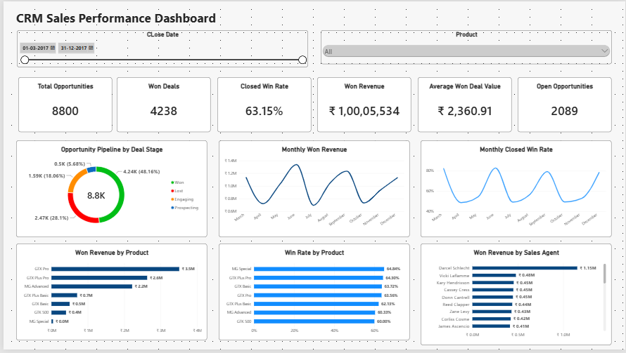
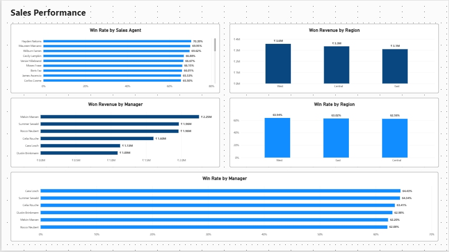
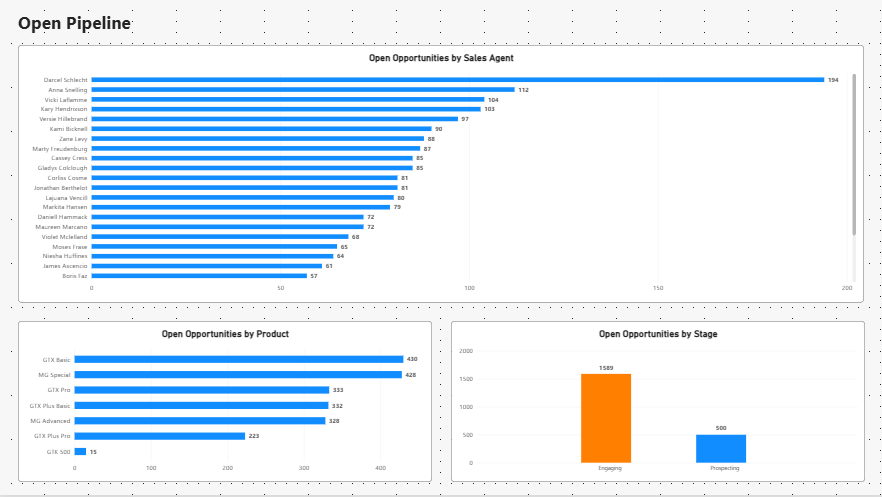

# CRM Sales Performance Dashboard

An end-to-end CRM sales analysis project built using **MySQL, Excel, Power Query, and Power BI**.  
The project analyzes sales opportunities, deal stages, revenue, win rates, products, sales agents, regions, managers, and open pipeline.

## 📊 Project Overview

This project transforms CRM sales data into an interactive Power BI dashboard designed to help understand:

- Overall sales performance
- Won and lost opportunities
- Revenue generated from won deals
- Win-rate trends over time
- Product-level performance
- Sales-agent performance
- Regional and manager performance
- Current open sales pipeline

The analysis combines **SQL querying, Excel analysis, data transformation with Power Query, and DAX measures in Power BI**.

## 🛠️ Tools & Technologies

- **MySQL** — database creation, SQL analysis, aggregation, joins, and business queries
- **Microsoft Excel** — data analysis and supporting workbook
- **Power Query** — data cleaning and transformation
- **Power BI** — interactive dashboard and data visualization
- **DAX** — calculated measures and performance metrics

## 📈 Dashboard

The Power BI dashboard is organized into three pages.

### 1. Executive Overview

Provides a high-level view of CRM performance with:

- Total Opportunities
- Won Deals
- Closed Win Rate
- Won Revenue
- Average Won Deal Value
- Open Opportunities
- Opportunity pipeline by deal stage
- Monthly won revenue
- Monthly closed win rate
- Revenue by product
- Win rate by product
- Revenue by sales agent



### 2. Sales Performance

Focuses on sales-team performance across:

- Agent Win Rate
- Won Revenue by Region
- Regional Win Rate
- Won Revenue by Manager
- Manager Win Rate



### 3. Open Pipeline

Focuses specifically on active opportunities:

- Open Opportunities by Sales Agent
- Open Opportunities by Product
- Open Opportunities by Stage



## 🔢 Key Metrics

The final dashboard contains **8,800 opportunities**, including:

| Metric | Value |
|---|---:|
| Total Opportunities | 8,800 |
| Won Deals | 4,238 |
| Lost Deals | 2,473 |
| Closed Deals | 6,711 |
| Open Opportunities | 2,089 |
| Closed Win Rate | 63.15% |
| Won Revenue | ₹10,005,534 |
| Average Won Deal Value | ₹2,360.91 |

## 🗄️ SQL Analysis

The SQL component contains the CRM database structure and analytical queries.

The database is organized into four main tables:

- `accounts`
- `products`
- `sales_pipeline`
- `sales_teams`

The SQL analysis covers:

- Opportunity counts by deal stage
- Overall win rate
- Product revenue and win rate
- Sales-agent performance
- Regional performance
- Manager performance
- Monthly revenue trends
- Monthly win-rate trends
- Open pipeline analysis

The complete SQL script is available here:

[View CRM SQL Analysis](SQL/crm_sales_db.sql)

## 📗 Excel Analysis

The supporting Excel workbook contains the analysis used alongside the CRM dashboard.

[Download the Excel Analysis](Excel/CRM_Sales_Analysis.xlsx)

## 📊 Power BI Dashboard

The complete Power BI project file is included in the repository.

[Download the Power BI Dashboard File](PowerBI/crm_sales_dashboard.pbix)

> The `.pbix` file requires Microsoft Power BI Desktop to open and interact with the report.

## 📁 Repository Structure

```text
CRM-Sales-Performance-Dashboard/
│
├── PowerBI/
│   └── crm_sales_dashboard.pbix
│
├── Excel/
│   └── CRM_Sales_Analysis.xlsx
│
├── SQL/
│   └── crm_sales_db.sql
│
├── Screenshots/
│   ├── Executive_Overview.png
│   ├── Sales_Performance.png
│   └── Open_Pipeline.png
│
└── README.md
